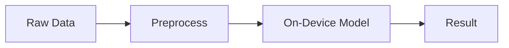
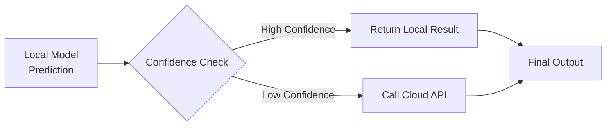

**📘 Module 4 - Privacy-Preserving AI Patterns**

Designing Local-First, Trustworthy Intelligence for Mobile Apps

Welcome to Module 4 - the one where we shift from “how ML runs on a device” → “how to design AI that respects user data, honors trust, and still feels powerful.”

This is a huge part of the future of Mobile × AI, and what gives on-device models a massive advantage over cloud-only solutions.

This module blends:

* engineering patterns

* real-world mobile constraints

* UX decisions

* privacy-first architecture

* hands-on guidance

Let’s get into it.


🎯 **Learning Goals**

* Understand why privacy is core to mobile AI

* Learn “Local-First” and “Hybrid-Inference” design patterns

* Know what data should never leave the device

* Implement offline inference fallbacks

* Add protective UX around AI predictions

* Understand when to use the Neural Engine vs cloud APIs

* Build a simple local-only pipeline in both iOS + Android

This module is technical + architectural + UX-driven - the full spectrum.

🔐 **1. Why Privacy Matters in On-Device AI**
Mobile apps touch the most personal data people generate:

* photos

* location

* motion

* voice

* biometrics

* daily habits & routines

* sensor patterns (health, driving, behavior)

Historically, apps sent this to servers.

With today’s on-device chips, you don’t need to anymore.

Advantages of local processing:

✔ Photos never leave the device

✔ Sensitive events never hit a server

✔ No server logs

✔ No user tracking by accident

✔ Reduced compliance overhead

✔ Offline intelligence “just works”

This is the strongest trust lever mobile apps can pull.


🧱 **2. Privacy Architecture Patterns**

🔹 A. Local-Only AI (Pure On-Device)

All inference happens on the phone.

Use when:

* data is extremely sensitive (photos, mic, health, driving)

* you need instant results

* offline matters

Architecture:



🔹 B. Hybrid Inference (Local First → Cloud If Needed)

Start on-device.
If the model is:

* too big

* too uncertain

* needs more context

then fallback to a cloud model.

Architecture:


You only send data when absolutely necessary - and only the minimum amount.

This is how:

* Gmail spam detection

* WhatsApp safety checks

* Google Photos features
work in practice.

🔹 C. Derived-Data Inference (Process → Quantize → Predict)

Instead of sending raw data (e.g., heart rate, motion logs), you compute local summaries:
* min

* max

* variance

* deltas

* counts

* cluster IDs

Then send only aggregates to cloud or back to your ML logic.

This is perfect for:

* wellness apps

* mindfulness tracking

* behavioral AI

* driving risk prediction

* anomaly detection

📱 **3. Real Examples (High-Impact Use Cases)**

🩺 A. Health & Stress Detection

You never send raw heart rate logs.
Instead you compute:

* resting baseline

* overnight BPM variance

* unusual spikes

* recovery slope

Only the derived pattern (a few numbers) is processed.

This protects:

* identity

* daily routines

* raw biometrics

🚗 B. Driving Behavior & Safety

Use motion sensors, speed deltas, and event frequency locally to detect:

* harsh braking

* cornering force

* distracted motion

* smoothness score

But never upload:

* raw GPS

* full accelerometer streams

* timestamped movement logs

This is the gold standard for ethical behavioral AI.

🧩 **4. Implementing Privacy-Preserving Patterns**

✨ A. iOS Example: Local-Only Confidence Filter (Swift)

```
let result = classifier.classify(image)

if result.confidence > 0.85 {
    // Local model trusts itself
    return result.label
} else {
    // Fallback to cloud model ONLY if user opted-in
    if userSettings.allowCloudFallback {
        return cloudModel.predict(image)
    } else {
        return "Unsure"
    }
}
```

This is ethically ideal for sensitive inputs (faces, documents, kids’ images).

🤖 B. Android Example: Hybrid Flow (Kotlin)

```
val local = classifier.classify(bitmap)

return if (local.confidence >= 0.75f) {
    local
} else {
    if (settings.cloudFallbackEnabled) {
        cloudPredict(bitmap)
    } else {
        ClassificationResult("unsure", 0.0f)
    }
}
```

This pattern prevents sending unnecessary data to servers.

🧠 **5. UX Patterns for Privacy-Focused AI**

Privacy isn’t just engineering - it’s experience design, too.

✔ Show when processing stays on-device

> "This analysis happens entirely on your device."

✔ Give users control

Toggle:
> Use cloud for low-confidence predictions?

✔ Never surprise the user

If you switch between on-device → cloud, show a subtle explanation.

✔ Use gentle language

Instead of “Low confidence,” say:
> "I’m not fully sure about this one."

✔ Add "inspectability"

A simple “Why this result?” link builds trust.

This module is where AI becomes human.


🧪 **7. Build-This Challenge (End of Module Task)**

Pick one of these and implement it in your iOS or Android project:

Option A: Add a confidence threshold → fallback → UX message

Option B: Compute derived data (variance / min / max) and feed to a simple model

Option C: Add a toggle for “Local-only mode” in settings

Option D: Add an explanation UI (“Why this guess?”)

Completing even one of these builds real skill (and résumé-ready proof).


🎉 **Module 4 Complete**

You’ve now learned how to build trustworthy, ethical, local-first AI — the kind that users actually feel comfortable with.

This module also advances your course into deeper, more meaningful territory — and positions you as the Mobile × Privacy × AI leader you’re becoming.